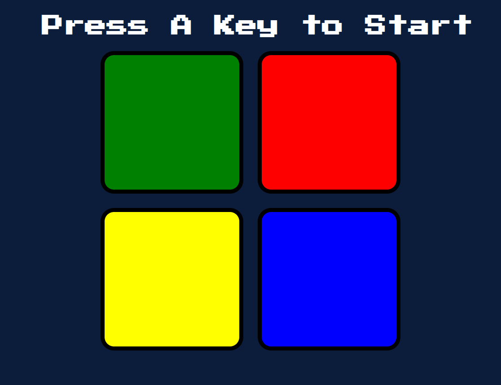

<h1 align="center">Simon Game Replica: </h1>

<h2>A JavaScript replica of the classic electronic memory game "Simon."</h2>

<h2>Description:</h2>

<h3>This project is a web-based version of the Simon Game, a memory game that challenges players to repeat a sequence of flashing lights and sounds. The game has been built using HTML, CSS, and JavaScript.</h3>

Features  
Simulates the classic Simon Game experience. 
Generates random sequences for players to follow.  
Provides audio and visual feedback for player interactions. 
Tracks and displays the player's score. 
Gradually increases the difficulty by adding more steps to the sequence. 
Includes a "strict" mode that restarts the game when a mistake is made.

<h2>You can play the game online by visiting the following link: Play Simon Game</h2>

<h2>Technologies Used</h2>
    <ul>
        <li>HTML</li>
        <li>CSS</li>
        <li>JavaScript</li>
        <li>jQuery (for DOM manipulation)</li>
    </ul>

<h2>Credits</h2>

Original Simon Game concept 
  UI/UX design inspired by classic Simon Game visuals 
  Udimy course 

    <h1>Simon Game Replica</h1>
    
A JavaScript replica of the classic electronic memory game "Simon."

    

    <h2>Description</h2>
    
This project is a web-based version of the Simon Game, a memory game that challenges players to repeat a sequence of flashing lights and sounds. The game has been built using HTML, CSS, and JavaScript.

    <h2>Features</h2>
    <ul>
        <li>Simulates the classic Simon Game experience.</li>
        <li>Generates random sequences for players to follow.</li>
        <li>Provides audio and visual feedback for player interactions.</li>
        <li>Tracks and displays the player's score.</li>
        <li>Gradually increases the difficulty by adding more steps to the sequence.</li>
    </ul>

    

    
You can play the game online by visiting the following link: 

    <h2>Technologies Used</h2>
    <ul>
        <li>HTML</li>
        <li>CSS</li>
        <li>JavaScript</li>
        <li>jQuery (for DOM manipulation)</li>
        <li>Audio API (for sound effects)</li>
    </ul>

    <h2>Credits</h2>
    <ul>
        <li>Original Simon Game concept by Ralph Baer and Howard J. Morrison</li>
        <li>UI/UX design inspired by classic Simon Game visuals</li>
        <li>Udemy JS course</li>
    </ul>

    <h2>License</h2>
  
